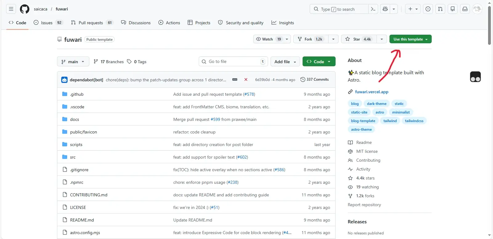

# 初始化

## 方式1：Github上直接使用模板

打开
::github{repo='saicaca/fuwari'}
，然后点开下图Use this template按钮  
  
然后跟Github的流程走，获得了自己的仓库之后clone下来。

## 方式2：本地创建

随便选一个文件夹，运行`pnpm create fuwari@latest`。

# 第一篇文章

::github{repo='saicaca/fuwari'}
的README里面有一些内容。  
还可以根目录运行`pnpm dev`，然后打开网页，里面会有几个文章，请自己阅读，这是一些基本教程。

# 部署

有各种部署方式，这里选Edgeone Pages国际版进行讲解，如果不是请自己探索。  
本篇所有内容都是建立在你有一个域名接入了Edgeone的前提下。

## 创建Pages

先推送你本地git里面的内容。  
打开Pages选项卡，选择新建Pages，并且关联你的Github仓库。  

## 自定义域名

打开那个Page的域名管理选项卡，点击新建域名，输入你的域名然后跟着Edgeone的提示接入。